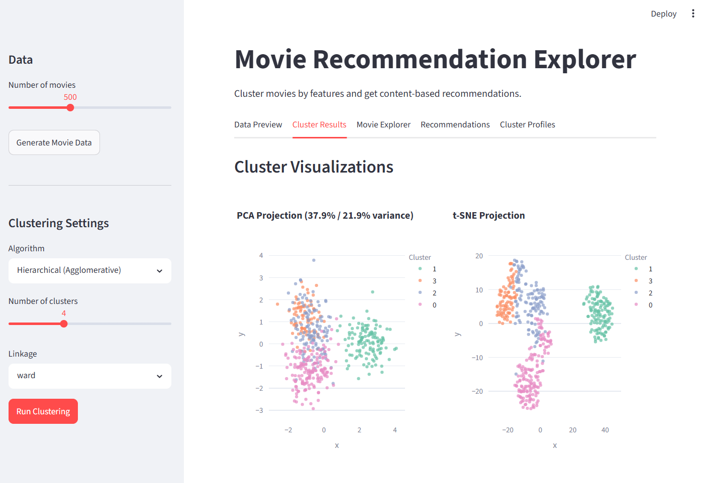

# Movie Recommendation Explorer

Cluster movies by features and get content-based recommendations. Built with Streamlit and scikit-learn.



## Quick Start

```bash
pip install -r requirements.txt
streamlit run app.py
```

## Implementation Details

### Data (`utils/data.py`)

Generates synthetic movie data using 4 underlying profiles drawn from multivariate normal distributions:

| Profile | Vote Avg | Popularity | Runtime | Budget (M) | Dominant Genres |
|---------|----------|------------|---------|------------|-----------------|
| Blockbusters | ~7.0 | ~75 | ~140 min | ~$150M | Action (70%), Sci-Fi (50%) |
| Indie Dramas | ~8.0 | ~35 | ~110 min | ~$15M | Drama (80%), Romance (40%) |
| Horror | ~5.8 | ~45 | ~95 min | ~$10M | Horror (80%), Thriller (40%) |
| Comedies | ~6.5 | ~60 | ~100 min | ~$40M | Comedy (80%), Romance (30%) |

Each movie has 13 features: 5 numeric (vote_average, popularity, release_year, runtime, budget_mil) and 8 binary genre flags (Action, Comedy, Drama, Horror, Sci-Fi, Romance, Thriller, Animation).

### Feature Engineering (`utils/clustering.py:100-108`)

**`prepare_features()`** combines numeric and categorical features into a single matrix:
1. Numeric features are z-score standardized via `StandardScaler`
2. Genre flags are kept as binary (0/1) — already on the same scale
3. The two are concatenated horizontally (`np.hstack`)

### Clustering Algorithms (`utils/clustering.py`)

All algorithms operate on the combined feature matrix via a uniform interface:

| Algorithm | Implementation | Key Parameters |
|-----------|---------------|----------------|
| **KMeans (sklearn)** | `sklearn.cluster.KMeans` with k-means++ init (n_init=10) | `n_clusters` (2–8) |
| **KMeans (scratch)** | Custom `KMeansScratch` class — random init, Euclidean distance, centroid convergence check (`tol=1e-4`) | `n_clusters` (2–8) |
| **DBSCAN** | `sklearn.cluster.DBSCAN` | `eps` (0.1–3.0), `min_samples` (2–20) |
| **Hierarchical** | `sklearn.cluster.AgglomerativeClustering` | `n_clusters` (2–8), `linkage` (ward/complete/average/single) |

### Recommendation Engine (`utils/recommendations.py`)

**`get_recommendations()`** implements cluster-based content filtering:
1. Finds the seed movie's cluster assignment
2. Computes Euclidean distance between seed and all other movies in the same cluster on the full feature space
3. Returns the top-N nearest neighbors

### Visualizations (`utils/visualization.py`)

| Plot | Method | Description |
|------|--------|-------------|
| PCA Scatter | `compute_pca()` + `plot_cluster_scatter()` | 2D projection with % variance explained; hover shows movie titles |
| t-SNE Scatter | `compute_tsne()` + `plot_cluster_scatter()` | Non-linear 2D projection (perplexity=30) |
| Genre Composition | `plot_genre_composition()` | Grouped bar chart — genre prevalence % per cluster |
| Parallel Coordinates | `plot_parallel_coordinates()` | Multi-dimensional numeric feature comparison across clusters |
| Radar Chart | `plot_cluster_radar()` | Centroid comparison of scaled numeric features |
| Recommendation PCA | `plot_cluster_scatter()` with custom labels | Highlights seed movie + recommendations vs. the rest |

## Operating Instructions

### 1. Generate Data
- Sidebar → set **Number of movies** (200–1000, default 500)
- Click **Generate Movie Data**
- Data Preview tab shows raw data + numeric summary + genre frequency table

### 2. Run Clustering
- Select **Algorithm** from the sidebar dropdown
- Tune hyperparameters (appear dynamically based on algorithm choice)
- Click **Run Clustering**

### 3. Explore the 5 Tabs

| Tab | What you'll find |
|-----|-----------------|
| **Data Preview** | Raw movie table (first 100 rows), numeric stats, genre frequency count |
| **Cluster Results** | PCA scatter plot (with variance ratios), t-SNE scatter plot; hover for movie titles |
| **Movie Explorer** | Dropdown to pick a cluster → browse all movies assigned to it |
| **Recommendations** | Pick a seed movie → get top-N similar movies from the same cluster ranked by Euclidean distance + PCA plot highlighting seed and recommendations |
| **Cluster Profiles** | Per-cluster statistics table (mean/std of numerics, genre %, count), radar chart, genre composition bars, parallel coordinates |

### 4. Interpret the Results
- **Silhouette score** (displayed for KMeans) measures cluster separation — higher is better
- **Radar chart** shows which numeric dimensions define each cluster
- **Genre composition bars** reveal genre-based cluster identities
- **Recommendation distance** quantifies similarity within a cluster

## Project Structure

```
movie_recommendation_explorer/
├── app.py                  # Streamlit entry point (5 tabs)
├── requirements.txt        # Dependencies
├── APPLICATION_IDEA.md     # Original concept
└── utils/
    ├── data.py             # Synthetic movie data generation (4 profiles, 13 features)
    ├── clustering.py       # KMeans (scratch + sklearn), DBSCAN, Agglomerative
    ├── recommendations.py  # Cluster-based recommendation engine + profile computation
    └── visualization.py    # PCA, t-SNE, genre bars, parallel coordinates, radar charts
```

## Tech Stack

streamlit, scikit-learn, pandas, numpy, plotly
